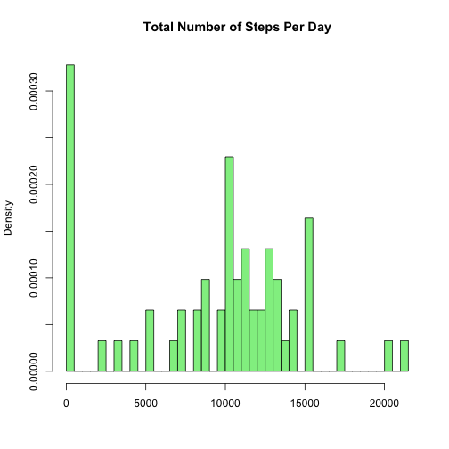
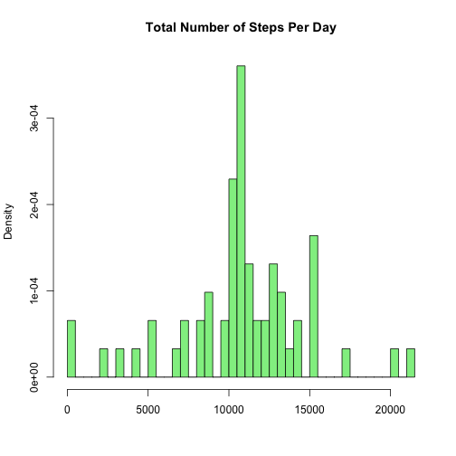
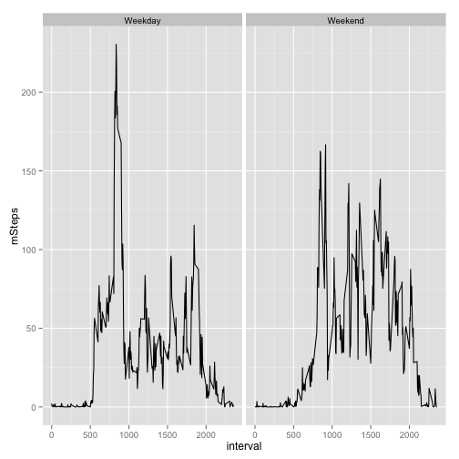

  
#### 1. Loading, decompressing and processing the data   


```r
setwd("/Users/petermerek/Desktop/Coursera/RepResearch")  
library(RCurl)                           ## for MAC OS to read https  
library(stringr)                         ## used for ifelse to string detect for day of week
library(dplyr)                           ## summarizing  
library(knitr)                           ## used for this doc  
library(ggplot2)                         ## used for panel chart  
```


```r
url<-("https://d396qusza40orc.cloudfront.net/repdata%2Fdata%2Factivity.zip")  
download.file(url, destfile="Factivity.zip", method="curl")  
unzip("Factivity.zip")  
activity<- read.csv("activity.csv",sep=",", header=TRUE)  
activity$date <- as.Date(activity$date,"%Y-%m-%d")  ## convert to date  
  
  
sumStepsPerDay <- activity %>%                       ## sum of steps by day
  group_by(date) %>%
  summarise(steps=sum(steps, na.rm=TRUE))  

aveStepsPerInterval <- activity %>%                  ## average of steps by day
  group_by(date) %>%
  summarise(mSteps=mean(steps, na.rm=TRUE))  

sumStepsPerInterval <- activity %>%                  ## sum of steps by interval
  group_by(interval) %>%
  summarise(steps=sum(steps, na.rm=TRUE))  


sumSteps<-sum(sumStepsPerDay$steps)                 ## calculations to check work
minSteps<-min(sumStepsPerDay$steps)  
maxSteps<-max(sumStepsPerDay$steps)  
medSteps<-median(sumStepsPerDay$steps)  
aveSteps<-mean(sumStepsPerDay $steps)  

x7<-max(sumStepsPerInterval)                       ## find interval with max mean steps  
x8 <- filter(sumStepsPerInterval,sumStepsPerInterval$steps==x7)  

data1 <-sumStepsPerDay$steps                       ## this is the vector for the histogram

x7<-max(sumStepsPerInterval)                       ## find max steps per interval, display interval #
x8 <- filter(sumStepsPerInterval,sumStepsPerInterval$steps==x7)
```

#### 2. What is mean total number of steps taken per day?  

- 1. This is a histogram of the total number of steps taken per day  


```r
hist(data1, freq=FALSE, main="Total Number of Steps Per Day", col="lightgreen", breaks=length(data1),xlab="",ylim=NULL)
```

 

- 2. The mean median of the total number of steps per day  
-- Mean  9354   
-- Median  10395    


#### 3.  What is the average daily activity pattern?    

- 1. Make a time series plot (i.e. type = "l") of the 5-minute interval (x-axis) and the average number of steps taken, averaged across all days (y-axis)   


```r
plot(aveStepsPerInterval$date, aveStepsPerInterval$mSteps, ylab="Average Steps per Interval",xlab="Date",type="l")
```

 

- 2. Which 5-minute interval, on average across all the days in the dataset, contains the maximum number of steps?    
-- Interval 835 has the max number of steps per day


#### 4. Imputing missing values  

- 1. Calculate and report the total number of missing values in the dataset (i.e. the total number of rows with NAs)  
-- Total number of recrods with msising values: 2304

- 2. Devise a strategy for filling in all of the missing values in the dataset. 
-- Strategy = mean imputation, use the mean of each interval over all days to replace for each interval that is missing data
-- ZEROs not replaced 

- 3. Create a new dataset that is equal to the original dataset but with the missing data filled in.  


```r
activity2<-activity                             ## 17,568 obs (split into NA and !NA)
xINA1 <- filter(activity,!is.na(steps))         ## 15,264 obs
xINA2 <- filter(activity,is.na(steps))          ## 2,304 obs

Min5 <- activity %>%                            ## use interval based mean(steps) to replace NA, 288 obs
  group_by(interval) %>%
  summarise(mSteps=round(mean(steps, na.rm=TRUE),2))
xINA2$steps<-0                                  ## replace NA with 0, just good house keeping

xINA3 <-merge(xINA2, Min5, by="interval")       ## merge new mSteps from Min5 for 2,304 obs
xINA3$steps <- xINA3$mSteps                     ## replace steps with mSteps later rbind
xINA3<-xINA3[,1:3]                              ## remove mSteps column
round(sum(xINA3$steps),0)                       ## should be 86,129
```

```
## [1] 86129
```

```r
activity3<-rbind(xINA1,xINA3)                   ## combine not NA and NA; back to 17,568 obs without NA
round(sum(activity3$steps),0)                   ## 656,737 (orig is 570,608)
```

```
## [1] 656737
```


-  4. Make a histogram of the total number of steps taken each day and Calculate and report the mean and median total number of steps taken per day. 


```r
sumStepsPerDay2 <- activity3 %>%   ## calculate total number of steps per day 
  group_by(date) %>%
  summarise(steps=sum(steps))

sumSteps<-sum(sumStepsPerDay2$steps)     ## calulations to check the work  
minSteps<-min(sumStepsPerDay2$steps)  
maxSteps<-max(sumStepsPerDay2$steps)  
medSteps<-median(sumStepsPerDay2$steps)  
aveSteps<-mean(sumStepsPerDay2$steps)  
  
data2 <-sumStepsPerDay2$steps  ## vector for histogram
hist(data2, freq=FALSE, main="Total Number of Steps Per Day", col="lightgreen", breaks=length(data2),xlab="",ylim=NULL)
```

 

- 5. Do these values differ from the estimates from the first part of the assignment? What is the impact of imputing missing data on the estimates of the total daily number of steps?  

###### Yes. initially, mean was 9354, it is now 10766; median was 10395, it is 10766

###### In the case of mean imputation, basically moved the large volume of NA to the mean in the histogram and thus driving std dev towards the center or "0"  


#### 5. Are there differences in activity patterns between weekdays and weekends?  

- 1. Create a new factor variable in the dataset with imputed values with two levels – “weekday” and “weekend” indicating whether a given date is a weekday or weekend day.    


```r
activity3$weekday<-weekdays(activity3$date)       ## 17,568 obs, 4 var

activity3$indicator <-  ifelse (str_detect(activity3$weekday, 'Saturday'),  activity3$indicator<-'Weekend',
                        ifelse (str_detect(activity3$weekday, 'Sunday')  ,  activity3$indicator<-'Weekend',
                                        'Weekday'))
```


- 2. Make a panel plot containing a time series plot (i.e. type = "l") of the 5-minute interval (x-axis) and the average number of steps taken, averaged across all weekday days or weekend days (y-axis).  


```r
library(ggplot2)

aveStepsPerIndicator <- activity3 %>%               ## ave steps per interval per indicator (weekday or weekend) 
  group_by(interval,indicator) %>%
  summarise(mSteps=round(mean(steps, na.rm=TRUE),2))


xyz <- ggplot(aveStepsPerIndicator) +
  geom_line(aes (x=interval, y=mSteps))
xyz <-xyz + facet_grid(. ~ indicator)
xyz
```

 
